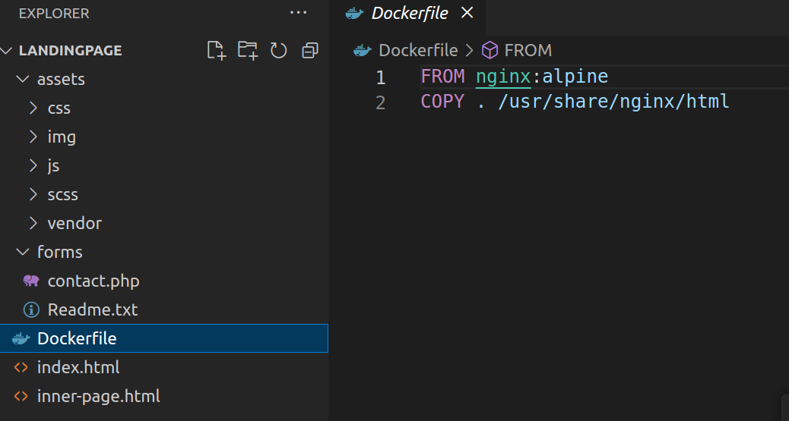

Application Deployment Guide
This guide provides step-by-step instructions for deploying your application using Docker and Kubernetes.

Prerequisites
Before you begin, ensure you have the following installed:

Docker: Install Docker
Kubernetes: Install Kubernetes
kubectl: Install kubectl
Docker Hub account: Sign in or Sign up for Docker Hub
Dockerizing Your Application
Follow these steps to package your application into a Docker container:

Dockerfile: Create a Dockerfile in the root directory of your application with the following content.

Dockerfile
Copy code
FROM nginx:alpine
COPY . /usr/share/nginx/html

Build Image: Build your Docker image using the following command:

bash
docker build -t your-dockerhub-username/your-image-name:tag .
Replace your-dockerhub-username, your-image-name, and tag with appropriate values.

Pushing Image to Docker Hub
Follow these steps to push your Docker image to Docker Hub:

Login to Docker Hub: Log in to Docker Hub using the following command:

bash
Copy code
docker login
Enter your Docker Hub username and password when prompted.

Tag Image: Tag your Docker image with your Docker Hub username and repository name:

bash
Copy code
docker tag your-image-name your-dockerhub-username/your-image-name:tag
Replace your-dockerhub-username, your-image-name, and tag with appropriate values.

Push Image: Push your Docker image to Docker Hub:

bash
Copy code
docker push your-dockerhub-username/your-image-name:tag
Replace your-dockerhub-username, your-image-name, and tag with appropriate values.

Deploying Application to Kubernetes

Apply the manifests using
kubectl apply -f deployment.yaml service.yaml

